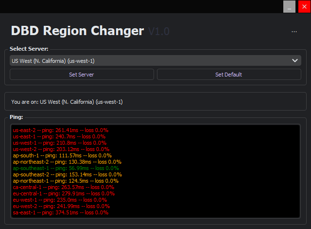
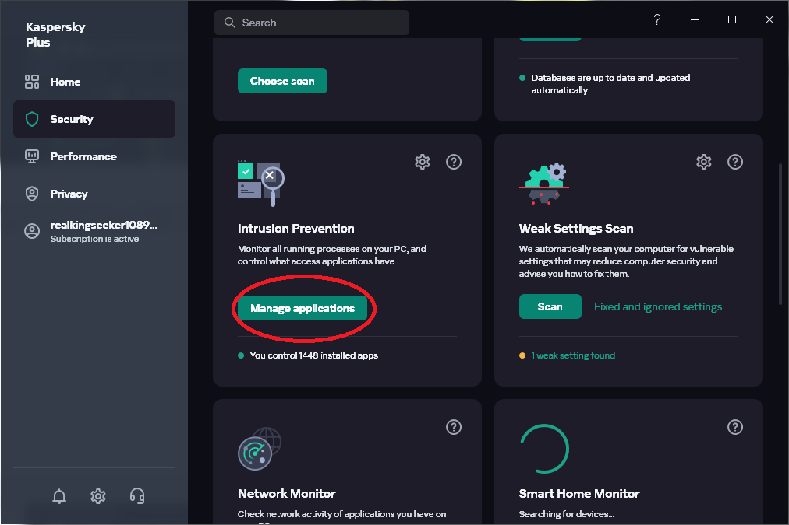
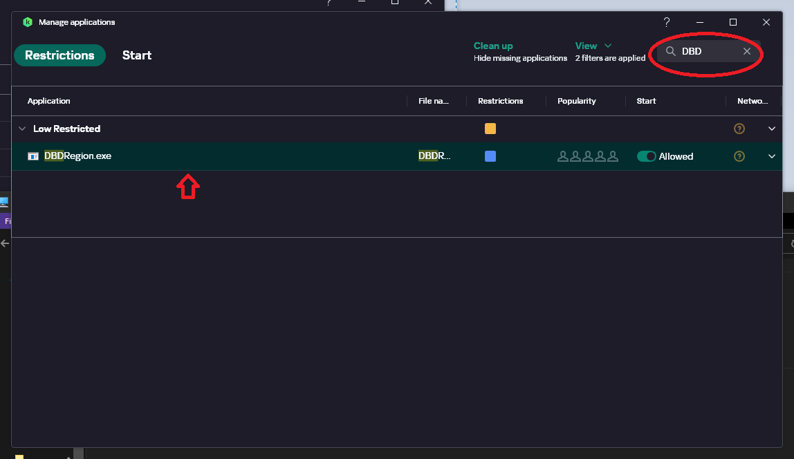
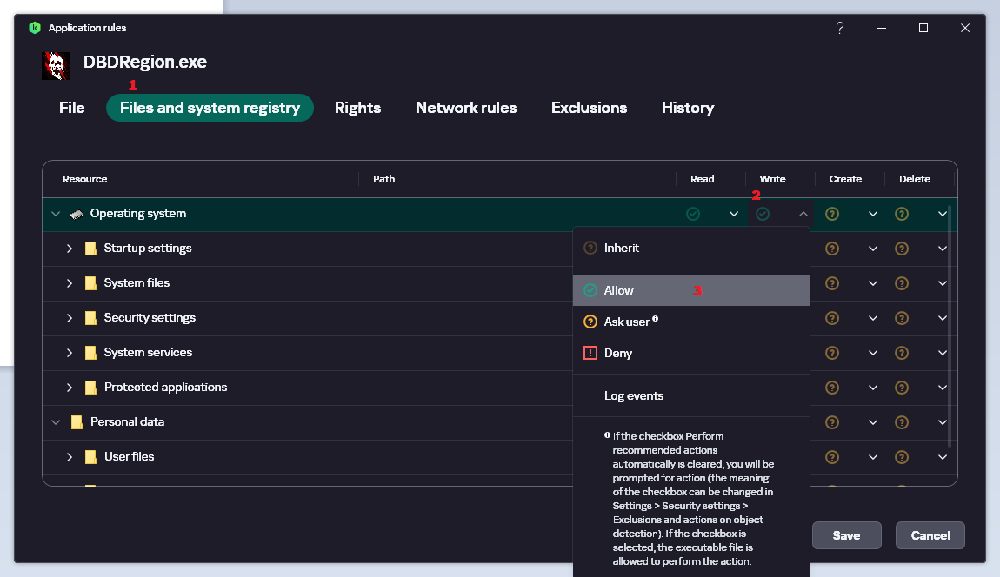

# DBD-Region-Changer
Simplifies server selection to connect to any Dead by daylight servers

## How to Use
1. [Download the program](https://github.com/Kinuseka/DBD-Region-Changer/releases/latest)
2. Open the app and allow UAC popup [why?](#questions)
3. Enjoy

**Notice:**

The game needs to be restarted everytime you switch a server

## Antivirus Mitigation
Some antivirus has advanced security measure to defend against malicious modification on important files. The hosts file is located on `C:\Windows\System32\drivers\etc\hosts` which is a protected directory and so therefore is protected.

Despite the application's elevated permission antiviruses like Kaspersky still remains suspicious on newer apps and or unverified apps which causes the `Permission Error` on application after clicking the Set Server button. 

There are 2 options;
1. Disable the intrusion protection or the antivirus itself.
2. The application needs to be added into the exceptions list.

Since option 1 is very intrusive then option 2 is the only plausible solution:

### Antivirus (Kaspersky):
1. Open Kaspersky
2. Go to Security
3. Scroll and find Intrusion Prevention
4. Click manage applications

5. Search app name (usually `DBDRegion.exe`)
6. Double click the application

7. Go to Files and system registry
8. Operating system setting, and set the write to allow

9. Click save and allow the changes

## Questions
**Q: Why does the program require admin permissions?**

**A: Admin permissions are necessary because the program modifies the hosts file in your system, and is only modifiable by an administrator**

**Q: How does the program operate?**

**A: The game uses AWS Gamelift servers, the program modifies the IP Address of the hostname by forcing them to connect to a particular region**

**Q: How do I know this is safe?**

**A: It's understandable to approach the program with caution, especially considering the level of permissions it requires. The source code is open-source, and you are free to inspect it for any potential security concerns.**

**For transparency all ENDPOINTS it communicates on the internet are stored on the `constants.py`. Feel free to modify it to your liking if you are uncomfortable with the current setting** 

**The binaries provided are uploaded without any modifications and are presented as they exist in the repository. Users have the freedom to either build their own binary application or execute it as a Python script.**
